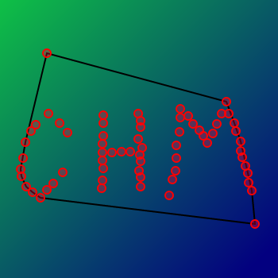

# General

ConvexHullMaker is little program to create convex hulls.

It tries to effectively solve the dynamic convex hull problem.

WARNING: Lining up the hull results in undefined behavior!

# Algorithms

n - total number of points on scene

m - number of points in hull

## I. AddPoint

1. Check whether we are inside the polygon using logarithmic complexity.

2. If this is not the case, check which hull points are visible and which are not.

3. Replace visible points (excluding boundary ones) with a new point

### Complexity

T(addPoint) = O(log(m)), if interior of the hull containts point

T(addPoint) = O(m), otherwise

## II. RemovePoint

1. Check whether the hull contains target point(p).

2. If it's our case delete triangle (p-1), (p), (p+1).

3. Find all points in deleted triangle.

4. Build convex polygon from this points.

5. Merge hull and new polygon.

### Complexity

T(removePoint) = O(nlog(n)), if the hull contains point

T(removePoint) = O(m), otherwise

# Usage

You can add points by clicking the mouse or remove them by clicking again. 

In this case, the convex hull will be constructed automatically. 

Then the result can be saved to a file by pressing the [↓] button. 

By default, the file name is changed after saving, but you can check the [rewrite] checkbox to avoid this behavior.

There are also several features to customize and simplify usage:

## Command line arguments

When you run the application from the console, then you can change some of its parameters

using this syntax: `app.exe key1=value1 key2=value2 ... keyN=valueN`.

Examples:

`app.exe ps=13 rnd=1 pc=green`

`app.exe pc=#55ff0033` - hex color in ARGB format

`app.exe pc=#ff0033` - hex color in RGB format

`app.exe pc=red` - name of required color

| key | type | description |
|-----|------|-------------|
ps   | positive integer          | point visible radius
pc   | color(hex or name)        | color of points
psw  | positive integer          | width of points outline(stroke)
psc  | color(hex or name)        | color of points outline(stroke)
hlw  | positive integer          | width of hull lines
hlc  | color(hex or name)        | color of hull lines
rnd  | integer between 0 and 100 | number of random points
undo | zero or positive integer  | maximum number of undo operations

## Shortcuts

| Keys  | Actions |
|-------|---------|
X | clear scene
R | check/unchek rewrite option
P | open save file dialog
G | *generate new random points
Ctrl + S | save hull
Ctrl + Z | undo
Ctrl + Shift + Z | redo
Ctrl + Y | also redo

*It only works if you specified rnd property in command line arguments. 
And it also remove all previous points.